# 서비스 소개

### 1. 서비스 설명

#### 개요

- 한줄 소개 : 온택트에 익숙해진 현대인을 위한 `웹 화상 게임` 서비스
- 서비스 명 : **나랑(Narang)**

#### 타겟 🎯

- 새학기를 맞이한 학생들
- 팀프로젝트, 단체생활을 시작하게 된 사람들
- COVID-19로 인해서 함께 일할 수 없게 된 사람들

👉 **팀 빌딩이 필요한 모든 사람들**

### 2. 기획 배경

#### 배경

우리는 프로젝트나 단체 활동에서 모르는 사람들과 팀을 꾸려 일을 시작할 때 어색함을 느끼곤 합니다. `나랑`은 이러한 어색함이 제대로 해소되지 않고, 프로젝트를 진행했을 때 생기는 문제에 집중했습니다.

이 `어색함`은 서로에게 실례가 될까봐 의견을 제시하지 못하거나, 원하지 않는 의견에 어쩔수 없게 동의하여 프로젝트의 진행 과정과 성과에 불이익을 초래합니다.

반면 적절한 `아이스브레이킹`으로 팀원들간에 친밀감이 있는 상태에서 프로젝트가 진행되면 *1)일의 성과가 더 높고, *2)의사결정에 긍정적인 결과가 있다고 합니다. 

#### 목적 🥅

**처음 팀을 이룬 사람들이 효과적으로 아이스브레이킹을 하게 하자**

#### 의의

- 비대면 상황에서 직접 만나지 않고도 즐길 수 있는 온라인 웹 화상 게임
- 간단한 게임으로 서로를 더 잘 알아가고, 아이스브레이킹의 효과

### 3. 서비스 화면

순서대로 홈, 마이페이지, 대기실, 게임방, 그리고 **마피아와 콜마이네임** 시연 영상입니다.

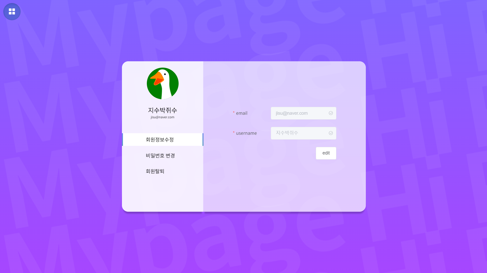

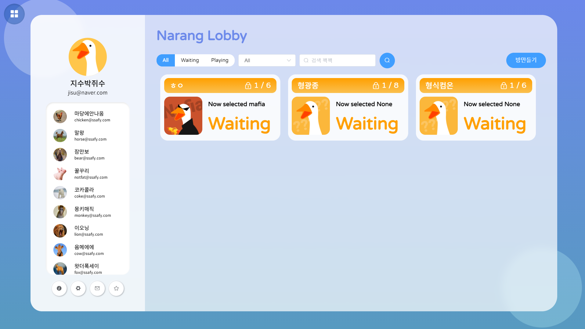

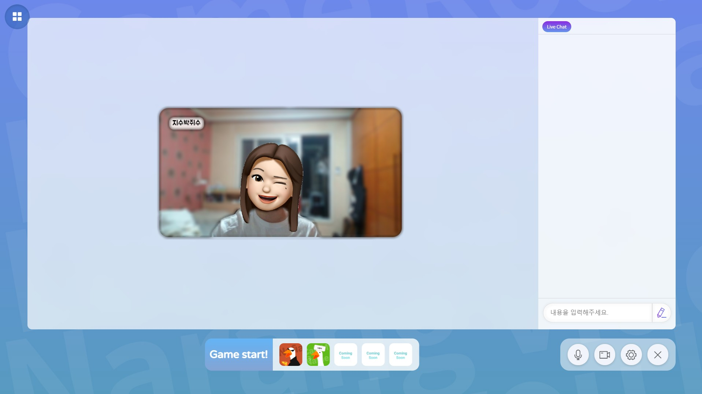

👇 시연영상 youtube 👇

### 4. 우수작 발표 영상

👇 우수작 발표 영상 youtube 👇

# 기술스택

### 1. WebRTC

#### WebRTC란?

    
    

> WebRTC (Web Real-Time Communication)는 웹 브라우저 간에 플러그인의 도움 없이 서로 통신할 수 있도록 설계된 API이다. 
>
> W3C에서 제시된 초안이며, 음성 통화, 영상 통화, P2P 파일 공유 등으로 활용될 수 있다.

👉 **좀 더 자세한 내용은 [여기](https://z-watermelon-coding-log.tistory.com/35)**

#### openVidu [🔗](https://openvidu.io/)

> OpenVidu is a platform to facilitate the addition of video calls in your web or mobile application. It provides a complete stack of technologies very easy to integrate in your application. Our main goal is to allow developers to add real-time communications to their apps very fast and with low impact in their code.

WebRTC를 보다 간단하게 적용할 수 있고, 다양한 프레임워크와 호환성이 높은 openvidu를 사용하여 프로젝트를 진행했습니다. 사용 방법은 openvidu tutorail 또는, 프로젝트의 front 폴더 하위의 gameroom 등에서 확인 할 수 있습니다.

#### 적용

`나랑` 에서는 화상 통화를 가능케 하기 위해 openvidu를 사용합니다. 게임방, 마피아, 그리고 콜마이네임 컴포넌트에서 openvidu를 사용하여 사용자간의 비디오 스트림을 지원하여 실시간 영상 통화가 가능합니다.

### 2. Web Socket

#### web socket 이란?

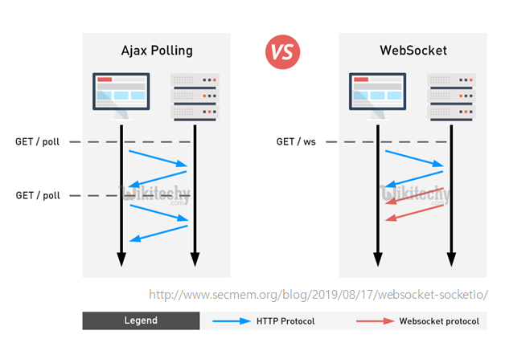

> 웹소켓(WebSocket)은 하나의 TCP 접속에 전이중 통신 채널을 제공하는 컴퓨터 통신 프로토콜이다. 웹소켓 프로토콜은 2011년 IETF에 의해 RFC 6455로 표준화되었으며 웹 IDL의 웹소켓 API는 W3C에 의해 표준화되고 있다. (이미지 출처 : http://www.secmem.org/blog/2019/08/17/websocket-socketio/)

일반적인 `Ajax` 통신과 다르게, 특정 `end point`를 구독하면 종단지점과 연결된 모든 통신을 수신할 수 있으며, 실시간 소통이 가능합니다. 그래서 실시간 채팅등에 많이 활용되고 있습니다. 아래 이미지를 통해 통신 방법을 간단히 이해할 수 있습니다.

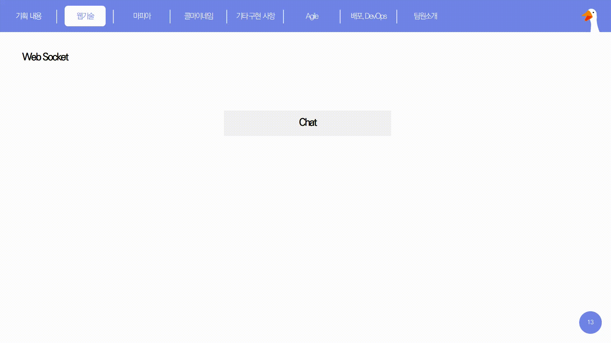

#### SockJS [🔗](https://github.com/sockjs/sockjs-client)

> SockJS는 WebSocket과 유사한 객체를 제공하는 브라우저 JavaScript 라이브러리입니다. SockJS는 브라우저와 웹 서버 사이에 짧은 대기 시간, 전이중, 도메인 간 통신 채널을 생성하는 일관된 브라우저 간 Javascript API를 제공합니다.

소켓 통신을 가능케하기 위한 첫 번째 라이브러리입니다. `SockJS `로 통신에 필요한 `end point` 로 `socket` 객체를 를 생성합니다.

#### Stomp.js [🔗](https://github.com/stomp-js/stompjs)

> 이 라이브러리를 사용하면 WebSocket을 통해 STOMP 브로커에 연결할 수 있습니다. 이 라이브러리는 모든 현재 프로토콜 변형을 포함하여 완전한 STOMP 사양을 지원합니다. 가장 인기 있는 메시징 브로커는 기본적으로 또는 플러그인을 사용하여 WebSocket을 통해 STOMP 및 STOMP를 지원합니다.

소켓 통신을 가능케하기 위한 두 번째 라이브러리입니다. `Stomp.js` 로 생성된 `socket` 객체로부터 `stompClient`를 생성하고, 연결 및 구독, 전송합니다. 프론트에서 소켓을 통해 전송된 내용은 백엔드에서 동일한 endpoint로 일괄적으로 수신되며, 백엔드에서 이를 다시 프론트로 전달합니다. 채팅 소켓에 경우 추가적인 처리 없이 받은 내용을 그대로 모든 구독자에게 반환하고, 투표등 집계가 필요한 경우에는 백엔드에서 로직을 통한 처리 후에 결과값을 반환합니다.

#### 적용

`나랑` 에서는 채팅과 게임의 실시간 상태 공유 및 진행에 web socket을 사용합니다. 서로 다른 여러개의 `endpoint`를 구독하고, 각각의 역할에 맞는 로직을 두어 게임을 진행합니다. 자세한 코드는 `back` 폴더 내에 `websocket`의 하위 폴더를 확인 할 수 있습니다. 

- `model`에서 주고받는 데이터의 구조를 설정합니다.
- `controller` 는 각 `endpoint` 와 그에 해당하는 method를 정의합니다.

- `request` 에서는 프론트로 부터 수신한 메시지의 형을 변환하거나, 필요한 필드를 추가합니다.

- `response` 에서는 리턴해야할 message에 맞게 특정 로직을 처리합니다. 채팅인 경우에는 그대로 반환하고, 투표의 경우 집계 후 반환합니다.

### 3. API

`나랑` 에서는 게임의 재미을 더하고, `나랑` 만의 차별점을 갖기 위해 다양한 API를 사용합니다.

#### Teachable Machine [🔗](https://teachablemachine.withgoogle.com/)

> Teachable Machine은 누구나 머신러닝 모델을 쉽고 빠르고 간단하게 만들 수 있도록 제작된 웹 기반 API입니다. 특정 동작, 영상, 이미지 등을 학습시켜 이를 모델로 추출하여 클라우드에 업로드하면, 코드내에서 import하여 사용이 가능합니다.

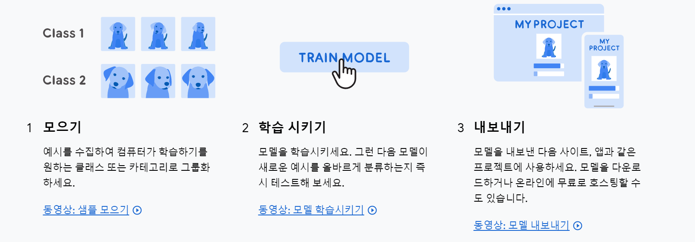

`나랑` 에서는 `Teachable Machine` 을 사용하여 `마피아 히든 미션`에 사용합니다. 자세한 내용은 하단의 `Nafia`에서 설명합니다.

#### face API [🔗](https://github.com/justadudewhohacks/face-api.js)

> JavaScript face recognition API for the browser and nodejs implemented on top of tensorflow.js core

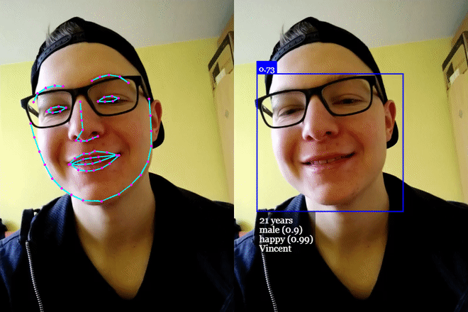

`나랑` 에서는 `face api`의 다양한 기능 중 위 이미지에 있는 2가지 기능을 사용합니다. `land mark` 와 `emotion detection` 을 사용합니다. 자세한 내용은 하단의 게임 컨텐스에서 소개합니다.

#### Web Speech API [🔗](https://developer.mozilla.org/en-US/docs/Web/API/Web_Speech_API)

> **웹 음성 API는** 사용자가 웹 애플리케이션에 음성 데이터를 통합 할 수 있습니다. Web Speech API는 `SpeechSynthesis`(텍스트 음성 변환) 및 `SpeechRecognition`(비동기 음성 인식 )의 두 부분으로 구성 됩니다.

Web Speech API는 크롬 브라우저에서 사용 가능한 api로 별도의 import 없이 몇 줄의 코드만으로 간단하게 사용할 수 있는 좋은 API입니다. 사용해볼 것을 강력히 추천합니다. 높은 인식률과 빠른 반응성을 보이는 좋은 API입니다. 다만 이어폰 등 마이크가 없으면 사용이 불가능합니다. 이 역시 게임 내 활용은 아래에서 기술합니다.

# 게임 컨텐스 소개

### 1. Nafia

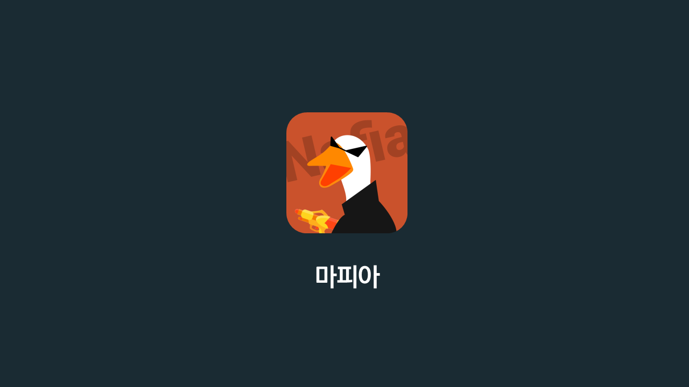

#### 게임 기본 설명

실제 게임 진행 방법과 과정에 대한 영상은 [여기](https://www.youtube.com/watch?v=lLfhXWhzst8)서 확인 할 수 있습니다

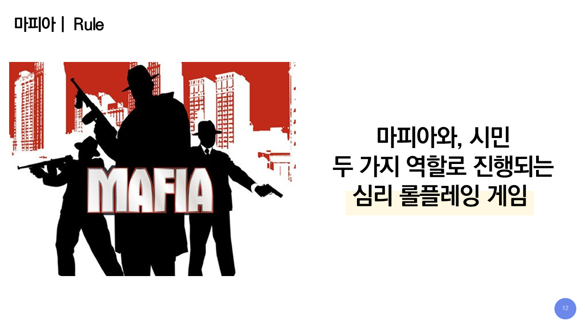

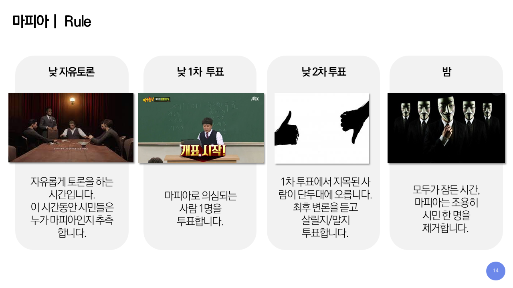

#### Nafia 특별 기능 1 : 마피아 히든 미션

마피아 히든 미션은 마피아에게만 주어지는 미션입니다. 마피아는 낮동안 자신에게 주어진 미션을 수행해야합니다. 만약 미션을 수행하지 못할 경우 밤이 되었을 때 시민을 제거 할 수 없습니다.

미션은 다음과 같이 특정 동작을 수행하는 것입니다.

히든 미션에 대한 동작 인식은 앞서 말했던 `teachable API`를 사용합니다. 아래 이미지를 통해 동작을 학습시키고, 인식하는 과정을 볼 수 있습니다.

    
    

관련 코드는 `front`의 `mafia.vue`에서 확인 할 수 있습니다. 미리 만들어 둔 모델을 가져온 후, 이를 원하는 비디오와 연결하여 사용합니다. 동작이 일치할 경우 일치된 시간동안을 카운트하고 카운트가 일정 횟수 이상이 될 경우 미션 완료라고 판단합니다.

🎮  이를 통해 마피아 게임 수행 중 마피아에게 패널티를 부여하고, 시민이 마피아를 찾아내는 데 결정적인 힌트를 주게 됩니다. 따라서 마피아 역할을 받은 사람에게는 게임의 난이도를 적절히 조정할 수 있으며, 게임을 재미를 더하는 기능을 합니다.

#### Nafia 특별 기능 2 : 거짓말 탐지 아이템

거짓말 탐지 아이템은 모든 플레이어가 사용할 수 있는 아이템입니다. 해당 아이템 사용 버튼을 클릭하고, 활성화된 상태에서 원하는 사람의 비디오를 클릭하면 5초간 표정의 변화를 감지하여 선택된 플레이어의 거짓말 사용 여부를 반환합니다. 동작은 아래 화면을 통해 확인할 수 있습니다.

`나랑` 은 거짓말 탐지를 위해 위에서 설명한 `face api`를 사용했습니다. face api에서는 비디오 내에서 얼굴을 인식하고, 얼굴에서의 표정변화를 감지하여 반환하는데, 이때 표정이 너무 자주 바뀌면 거짓말로 판별하게 했습니다. 콘솔에서 볼 수 있듯이 일반, 행복, 슬픔, 화남 등등의 표정을 분류할 수 있습니다.

관련 코드는 `front`의 mafia 하위의 `OvVideo.vue`에서 확인 할 수 있습니다. 비디오와 faceAPI의 모델을 가져와 객체를 생성하고, 이를 특정 시간동안 활성화하여 인식을 진행합니다.

🎮 이를 통해 마피아 게임 수행 중 시민이 마피아를 찾아내는 데에 도움을 주어 게임의 재미 요소를 추가합니다. 거짓말이라고 100% 신뢰할 수는 없겠지만, 참고자료로서 사용이 가능합니다.

### 2. Call my name

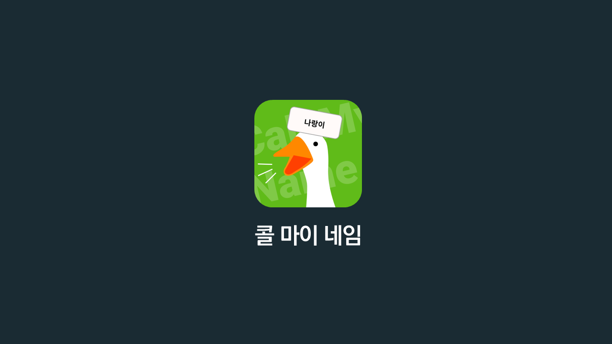

#### 게임 기본 설명

실제 게임 진행 방법과 과정에 대한 영상은 [여기](https://www.youtube.com/watch?v=lLfhXWhzst8)서 확인 할 수 있습니다

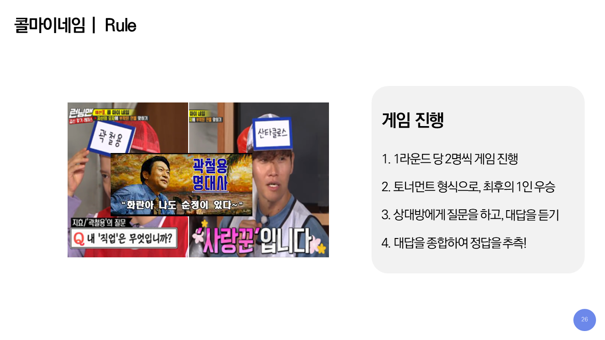

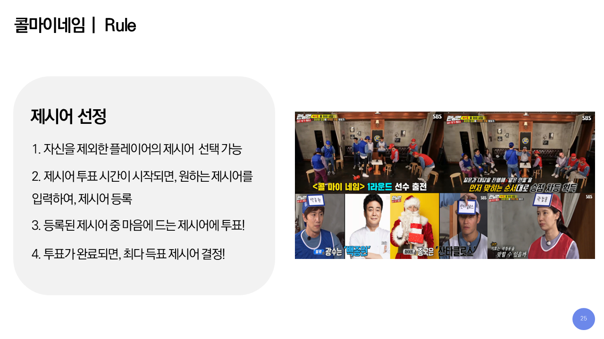

라운드가 시작되면, 플레이어 2인의 제시어를 정해야합니다. 화면 우측 상단의 제시어 투표창을 통해서 본인을 제외한 다른 플레이어의 제시어 투표가 가능합니다. 1️⃣ 입력창에 제시어를 입력하여 제시어를 추가하고, 2️⃣ 등록된 제시어 중에서 마음에 드는 제시어를 투표하고 3️⃣ 투표 완료 버튼을 누릅니다.

모든 플레이어가 투표완료를 누르면 해당 플레이어의 제시어가 결정됩니다. 동일한 방법으로 플레이어 2인의 제시어 선택이 모두 완료되면 게임이 시작됩니다.

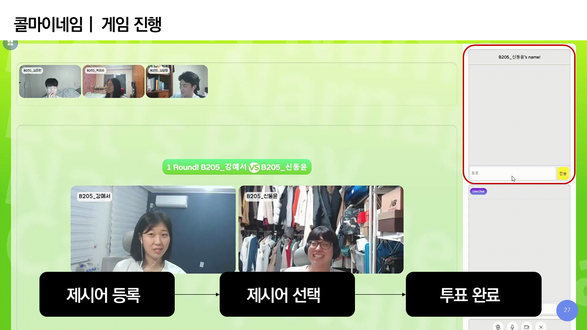

게임이 시작되면 상대방과 질문을 주고 받습니다. `스무고개` 처럼 질문을 하고 대답을 종합하여 정답을 추측합니다. 정답은 음성인식으로 확인 됩니다. 

정답을 알 것 같은 경우, `정답` 이라고 말하면 아래 이미지 처럼 `정답 인식 창`이 나타납니다.

이때 내가 생각하는 정답을 외칠 경우 이를 인식하여 모든 사람이 볼 수 있게 `자막이 생성되고`  `정답 체크` 가 진행됩니다. 

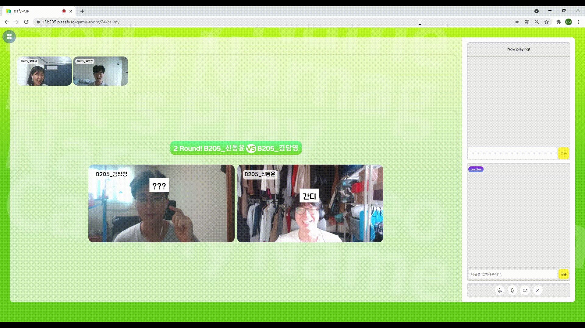

#### Call my name 특별 기능 1 :  이마 위 제시어

콜마이네임의 첫 번째 특별 기능은 이마 위 제시어 입니다. SBS 예능 `런닝맨` 에서는 실제로 모자 위에 부직포로 이름을 붙입니다. `나랑`에서도 이와 같이 이마에 제시어를 붙여주었습니다.

이는 `face api` 에서 얼굴의 눈코입 등 정보를 반환하는 `randmark` 기능으로 구현했습니다. 사용자의 비디오를 1초 단위로 인식하고 이때마다 눈의 위치를 반환 받습니다. 이때 반환받은 눈 위치에 제시어의 길이 등을 고려하고, 60px 정도 떨어진 곳에 제시어를 두어 이마 위에 제시어를 붙였습니다. 자세한 위치 조정은 `callmy` 폴더 내의 `OvVideo.vue`에서 확인 할 수 있습니다.

🎮 이를 통해 콜마이네임 게임 진행을 가능하게 하며, 자신의 제시어는 알 수 없게끔  `???`로 대체하고 다른 플레이어의 제시어만 볼 수 있게 했습니다. 

#### Call my name 특별 기능 2 :  음성 인식 정답 체크 & STT

콜마이 네임 두 번째 특별 기능입니다. 정답 체크를 음성인식으로 하여 게임의 편의성과 재미를 올렸습니다. 또한 예능에서 자막이 나오는 것처럼 내가 말한 정답이 모두에게 화면 아래쪽 자막처럼 생성되어 생동감을 높입니다. 

이 기능을 위해 Web Speech API를 사용하였고, 특정 예약어(`정답`) 를 설정하여 그 이후에 나오는 단어로 정답을 체크하게 했습니다. 아래 영상을 통해 확인 할 수 있습니다. 자세한 내용은 `call mt name`폴더 안의 `callmy-stt.vue`에서 확인할 수 있습니다.

<video src="README.assets/stttest2.mp4"></video>

🎮 이를 통해 TV에서 봤던 게임을 실제로 진행 할 수 있고, 음성인식으로 정답을 체크하여 재미와 편의성을 높입니다. 모두에게 공유되는 자막이 생성되어 관전자들은 마치 TV를 보는 시청자처럼 즐길 수 있습니다.

# 프로젝트 진행

프로젝트 진행 기간동안 전면 비대면으로, 온라인으로 진행되었기에 특히나 진행 방식과 소통 방법이 중요했습니다. 그래서 우리는 `Agile` 방법으로 프로젝트를 진행했고, Jira를 사용한 스프린트 관리, Docs를 활용하여 커뮤니케이션 리소스를 줄였습니다.

### 1. Git Flow

git flow 사용을 위해 `우아한 형제들`의 [git flow 사용](https://techblog.woowahan.com/2553/)을 참고했습니다. 각자 맡은 기능에 맞게 `feature` 브랜치를 생성하고, 완료된 기능은 `develop`에 merge하여 사용했습니다. 충돌 상황을 최소화하고자 매일 오전 스크럼에 `develop` 최신 버전을 `pull`받고 시작할 것을 강조했습니다.

또한 `commit message` 는 `[FE|jisu] mafia | 거짓말 탐지기 5초 제한, 게임당 1회 사용 제한 추가` 와 같이 통일하여 작성했습니다.

.gif)

### 2. Jira

매주 금요일 오후 회의에서 차주에 진행되어야 할 이슈를 백로그에 등록했습니다. 금주에 완료하지 못한 이슈나, 앞으로 진행할 이슈들을 추가합니다.

- 에픽은 가장 큰 단위인 기획, 유저관리, 마피아, 콜마이네임 등으로 구성하였습니다.

- 스토리는 실제 유저 플로우를 고려하여 `홈페이지에서 로그인 창을 통해 로그인 한다` 와 같이 작성하였으며,

- 이슈는 스토리를 완료하기 위한 작은 업무 단위로 생성했습니다. 예를 들어 `로그인 폼 생성`, `로그인 클릭 시 action 정의` `requestLogin 함수 정의` `Login token 발급` 등으로 구성했습니다.
- 에픽링크 태그를 사용하여 이슈를 구별하기 쉽게 했습니다.
- 무엇보다 담당자와 스토리 포인트 설정, 현재 작업중인 내용 지라에 실시간으로 반영하는 것을 가장 중요하게 생각했습니다.

### 3. Notion

모두가 공유해야할 자료 및 링크는 노션에 정리했습니다. 특히 `userflow`나 `api 명세` 와 같이 여러번 다시 봐야하고 중요한 정보들은 특히 노션에 공유하여 불필요한 커뮤니케이션 리소스를 줄이기 위해 노력했습니다. 

변수와 메서드의 naming rule, 인덴팅과 줄바꿈 규칙, vue에서의 state와 props 순서도 설정했습니다.

.gif)

# 배포

### 1. Docker

- openvidu 서버 : 8443

- 백엔드 서버 포트 번호 : 443

서로 다른 도커 이미지로 저장되어 있어 각각의 이미지를 실행시켜 실행합니다.

### 2. DevOps

`Jenkins`로  CI/CD를 구축하여 `push` 이벤트 발생시 build하도록 구성했습니다.

### 4. How to

서버는 letsencrypt를 사용하여 ssl 설정했습니다. `letsencrypt certonly --standalone -d [도메인명]` 명령어로 얻은 keyfile을 ~/apps/narang/certificates/live/[도메인명] 에 복사합니다. 진행 순서는 다음과 같습니다.

1. 로컬 프로젝트의 back 폴더에서 터미널 실행하여 gradle clean build 명령어 실행
2. aws ubuntu 접속
3. ~/apps/narang/libs 에 jar 파일 저장
4. ~/apps/narang에 docker-compose.yml 파일과 .env 파일 작성
5. ~/apps/narang/db 에 init.sql 파일 작성
6. `docker-compose up -d` 명령어로 컨테이너 다중 실행

# UI / UX

### 1. wireframe

figma를 사용해 홈페이지의 초안을 작성합니다. 관련 레퍼런스를 참고하고, 서비스 특성에 맞게 제작했습니다.

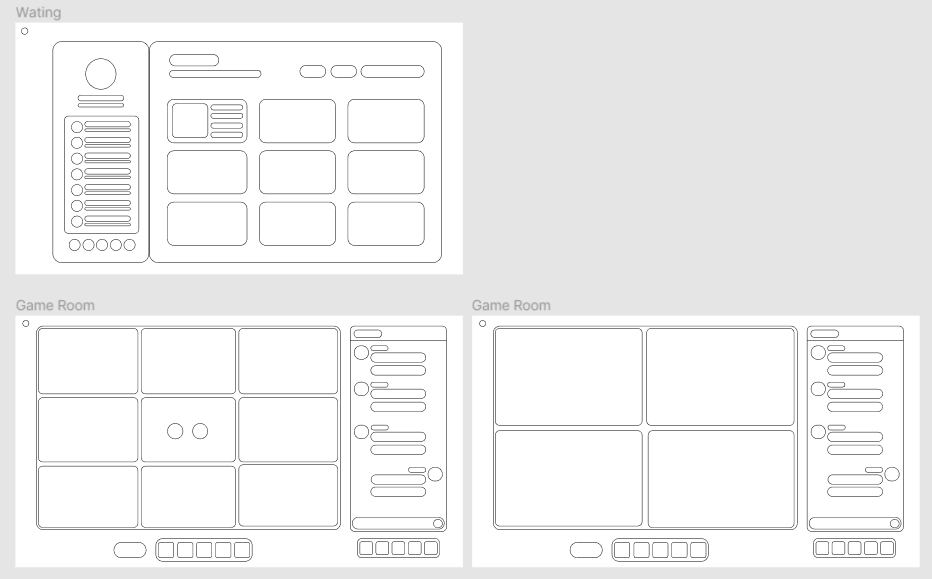

### 2. design

컴포넌트 단위로 디자인하였고, 게임의 배경, `너랑이` 도 그렸습니다. `게임`에 초점을 맞춰 웹 사이트보다는 앱에 비슷한 모습으로 구성했습니다.

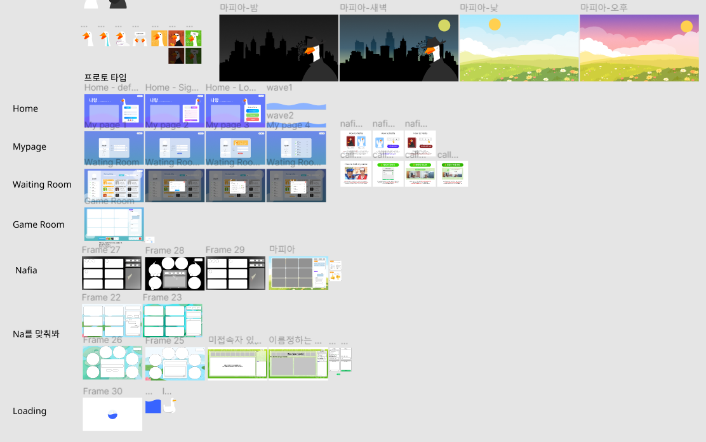

### 3. more

- 자주 사용되는 `dialog`는 기본적인 틀만 갖춘 컴포넌트로 구성해둡니다. 다른 컴포넌트를 `slot` 태그로 불러와서 사용합니다.

- `Loading` 화면을 구성하여 컴포넌트에 요소들이 모두 로드 되기 전까지 사용자의 동작을 제한합니다. `너랑이`가 둥실둥실 떠다니는 모습으로 구성했습니다.

  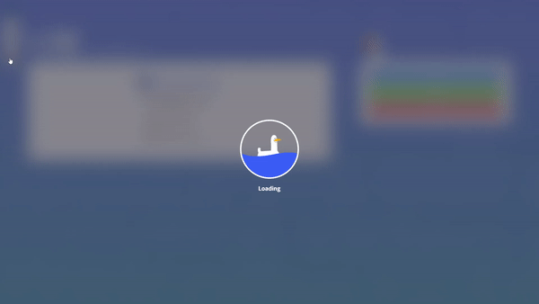

- 클릭 가능한 모든 요소는 `cursor: pointer` 를 추가했습니다.

- 반응형으로 구성하여 화면의 크기를 줄이면 그에 맞게 컴포넌트가 다르게 보여지게 합니다.

  

      
      
      
  

# 소감 및 배운점

### 1. 🐄🍅

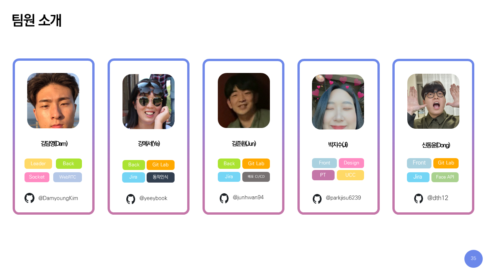

- 김담영 : 이번 프로젝트로 깃 플로우 지라와 같은 협업툴 사용에 익숙해질 수 있었고 역할 분담을 위해 자세하게 기획하고 정리하는 과정을 통해 협업하는 방법 또한 배울 수 있었습니다. 함께라면 어떠한 것도 해낼 수 있다는 자신감을 얻을 수 있었고, 배울점이 많은 팀원들을 만나 저 또한 성장할 수 있었습니다. 좋은 사람을 만난 것도 제게 큰 행운이라고 생각합니다.
- 강예서 : 팀원들 모두가 적극적으로 참여한 덕분에 **용두용미** 프로젝트로 유종의 미를 거둘 수 있었습니다.기술적인 부분 뿐만 아니라 협업 과정, 기획과 문서화의 중요성 등 너무 많은 것을 배우고 한 단계 더 성장할 수 있는 시간이었습니다.한 가지 아쉬웠던 점은 팀 분위기가 너무 좋았던 바람에 자소서에 쓸 만한 불화 썰이 나오지 않은 게 아쉽습니다.
- 김준환 : 처음에는 어느정도 구현이 될지 몰랐습니다. 그런데 단 한명도 ‘못할 것 같다’고 하지 않고 열심히 해서 프로젝트를 잘 마무리할 수 있었습니다. 팀원들과 함께 매일 웃으며 개발할 수 있어서 좋았습니다. 팀원들 덕분에 많이 배웠습니다 모두 고마워요**🌟**
- 박지수 : 혼자라면 절대 못했을 프로젝트. 5명이 모두 잘해줬기에 성공할 수 있었습니다. 팀워크와 협업의 중요성 그리고 각자의 장점이 모여 서로의 부족한 점을 보완하고 500% 이상의 시너지가 난다는것을 체감했습니다다다다다다. 깃 플로우, 지라를 사용해서 비대면 상황이더라도 효율적으로 소통하고 협업하는 법을 익혔다. 체력적(잠못잠)으로 정신적으로(왜안됨) 많이 힘들었지만, 그만큼 많이 배우고 성장했다. 정말 열정적으로 임했다고 자부할 수 있다.
- 신동윤 : 재밌는 프로젝트를 마음 맞는 팀원과 할 수 있어 행복했습니다. 6주의 시간이 어떻게 지나갔는지도 모를 정도로 모두가 프로젝트에 열정적이고 적극적으로 참여해주셔서 정말 감사합니다. 중간에 포기하고 싶을 때에도 웃으면서 하시는 모습에 힘이 나서 다시 일어설 수 있었습니다. 

### 2. 배운점

- 디버그의 중요성
  - 콘솔을 잘보자!!
  - 반복문이나 재귀는 종료조건, basecase가 제일 중요함!
- 개발전에 명세서나 기획서의 중요성
  - 대충 이렇게 하고 개발하면서 조율하자하는 건 굉장히 위험하다
  - 서로 머리속으로는 이해하지만 형체나 디테일은 다 다를 수 있다.
  - 정확하고 명확한 모델, 객체, 값, 변수는 미리 지정하여 문서화해야한다.
- 비대면 환경에서 커뮤니케이션 리소스가 너무 많이 든다
  - 문서화해서 정리하자
  - 웹엑스랑 디코는 아무튼 느리다 동시에 화면 공유를 여러번 하는것도 불편하다
  - 다 같이 달라붙어야 하는 일이 아니면 분업하고, 담당자끼리 컴팩트하게 협업하기

# 출처

1) [매일 경제, [회사 동료와 친할 수록 일의 성과도 더 커진다]](: https://www.mk.co.kr/news/business/view/2015/07/634151/) 

2. 문지원, “smart Icebreaker: 새로운 그룹 구성원 간의 대인매력을 강화시켜주는 게임 인터랙션 연구”, KAIST 문화기술대학원

